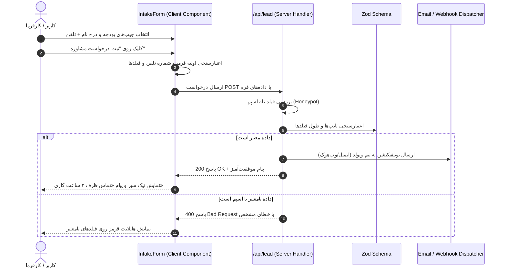

# ستون فقرات معماری فنی وب‌سایت وبولد (ARCHITECTURE-SPINE.md)

## ۱. بیانیه پارادایم معماری (Architecture Paradigm)
پروژه **Webold.ir** بر پایه الگوی **Server-First Component-Driven Architecture** با استفاده از **Next.js 15+ (App Router)** و **React 19** طراحی شده است. تمامی بخش‌های صفحه به صورت پیش‌فرض کامپوننت سروری (Server Component) رندر می‌شوند تا به بالاترین سرعت لود، حجم باندل حداقلی (Zero JS overhead) و نمره ۱۰۰ لایت‌هاوس دست یابیم. فقط برگ‌های تعاملی درخت کامپوننت (نظیر فرم چندمرحله‌ای لید و منوی معلق) از مرز `"use client"` استفاده می‌کنند.

---

## ۲. دیاگرام جریان و مرزهای معماری (Architecture Boundaries)

```mermaid
graph TD
    User([کاربر / مرورگر]) -->|درخواست HTTP / DNS webold.ir| CDN[Cloudflare / Edge Server]
    CDN -->|SSG / ISR Render| NextServer[Next.js 15 App Router]
    
    subgraph Server_Boundary [مرز کامپوننت‌های سرور - Zero JS]
        NextServer --> Layout[Root Layout + SEO Metadata + JSON-LD Schema]
        Layout --> Page[Home / Work / Services / Contact Pages]
        Page --> Hero[Hero Section - Static Content]
        Page --> Proof[Social Proof Bar]
        Page --> Portfolio[Curated Projects Server Grid]
        Page --> Services[Services Bento Server Grid]
        Page --> Footer[Minimal Footer with Real Contacts]
    end

    subgraph Client_Boundary [مرز کامپوننت‌های کلاینت - Interactive Leaves]
        Page -.->|Island| Nav[Floating Navbar / Mobile Menu]
        Page -.->|Island| Intake[Lead Intake Form + Budget Selector]
    end

    Intake -->|Server Action / POST Request| API[/api/lead - Zod Validation + Spam Protection]
    API -->|اعلان داخلی| Notification[Webold Lead Dispatcher / Email]
```

---

## ۳. تصمیمات پایدار معماری (Architectural Decisions - ADs)

### AD-01: هسته فنی و فریم‌ورک (Framework & Core Stack)
- **Binds:** فریم‌ورک فرانت‌اند و محیط اجرا.
- **Prevents:** تداخل رندرینگ کلاینت-ساید سنگین و افت پرفورمنس سئو.
- **Rule:** استفاده الزامی از **Next.js 15+ (App Router)**، **React 19** و **TypeScript** در حالت Strict Mode.

### AD-02: سیستم استایل‌دهی و توکن‌های دیزاین (Styling & Design Tokens)
- **Binds:** کلاس‌های CSS و سیستم دیزاین.
- **Prevents:** پراکندگی رنگ‌ها، کدهای CSS دستی ناسازگار و کاهش سرعت بارگذاری.
- **Rule:** استفاده از **Tailwind CSS v4** با متغیرهای CSS منطبق بر `DESIGN.md`:
  - `bg-canvas: #000000`
  - `bg-surface: #0A0A0A`
  - `border-subtle: rgba(255,255,255,0.08)`
  - `text-primary: #EDEDED`
  - `text-secondary: #A1A1AA`

### AD-03: جداسازی مرز کلاینت و سرور (Server vs Client Isolation)
- **Binds:** محل قرارگیری استیت‌ها و هوک‌های ری‌اکت.
- **Prevents:** تبدیل کل صفحه به کلاینت‌کامپوننت و افزایش حجم باندل جاوااسکریپت.
- **Rule:** صفحات اصلی (`page.tsx`) و بخش‌های محتوایی کاملاً Server Component هستند. فقط کامپوننت‌های فرم تعاملی و منو دارای دایرکتیو `"use client"` در بالاترین خط خود خواهند بود.

### AD-04: لایه داده و مدل‌سازی محتوا (Data Modeling & Static Sources)
- **Binds:** ساختار دیتای پروژه‌ها، خدمات و رضایت‌نامه‌ها.
- **Prevents:** وابستگی به دیتابیس سنگین در فاز اول و کندی در فچ داده‌ها.
- **Rule:** کلیه داده‌های نمونه‌کارها و خدمات در قالب آبجکت‌های تایپ‌شده تایپ‌اسکریپت در پوشه `src/data/` (مانند `projects.ts` و `services.ts`) نگهداری و در سرور مستقیماً Import می‌شوند.

### AD-05: اعتبارسنجی فرم‌ها و امنیت دریافت لید (Lead Validation & Anti-Spam)
- **Binds:** پردازش فرم استعلام پروژه.
- **Prevents:** دریافت اسپم و ورود داده‌های ناقص یا مخرب.
- **Rule:** فرم‌ها با **Zod** در سمت کلاینت و در سرور (Server Action / Route Handler) اعتبارسنجی می‌شوند. یک فیلد نامرئی Honeypot جهت جلوگیری از ربات‌های اسپمر تعبیه می‌گردد.

### AD-06: سئو و داده‌های ساختاریافته (SEO & JSON-LD Schema)
- **Binds:** خروجی متاتگ‌ها و ریچ‌اسنیپت‌های گوگل.
- **Prevents:** ناهماهنگی اطلاعات تماس و افت رتبه سئوی محلی.
- **Rule:** ساختار `layout.tsx` اسکیمای استاندارد `Organization` و `LocalBusiness` را به صورت تزریق داینامیک JSON-LD با اطلاعات رسمی (آدرس قائم مقام، تلفن `02166480076` و موبایل `09361059451`) تولید می‌کند.

---

## ۴. ساختار درختی پوشه‌ها و فایل‌های پروژه (Seed Directory Tree)

```
webold-landig/
├── public/
│   ├── favicon.ico
│   ├── og-image.png
│   ├── images/
│   │   ├── projects/          # تصاویر باکیفیت و فشرده WebP پروژه‌ها
│   │   └── logos/             # لوگوهای تک‌رنگ مونوکروم
│   └── fonts/                 # فونت‌های وب (Dana / Peyda / Geist)
├── src/
│   ├── app/
│   │   ├── layout.tsx         # لایوت اصلی، فونت‌ها، متاتگ‌های سئو و اسکیما
│   │   ├── page.tsx           # صفحه اصلی لندینگ‌پیج وبولد
│   │   ├── globals.css        # ریست، استایل پایه و توکن‌های Tailwind
│   │   ├── sitemap.ts         # سایت‌مپ خودکار
│   │   ├── robots.ts          # دستورات روبوت‌ها
│   │   ├── work/
│   │   │   ├── page.tsx       # آرشیو نمونه‌کارها
│   │   │   └── [slug]/page.tsx# جزئیات هر کیس‌استادی
│   │   ├── services/
│   │   │   └── page.tsx       # صفحه معرفی تفصیلی خدمات
│   │   ├── contact/
│   │   │   └── page.tsx       # صفحه تماس با استودیو
│   │   └── api/
│   │       └── lead/
│   │           └── route.ts   # اندپوینت دریافت و اعتبارسنجی فرم استعلام
│   ├── components/
│   │   ├── ui/                # کامپوننت‌های اتمیک پایه (Button, Input, Badge, Pill)
│   │   │   ├── button.tsx
│   │   │   ├── badge.tsx
│   │   │   └── input.tsx
│   │   ├── layout/            # اجزای اسکلت‌بندی صفحه
│   │   │   ├── navbar.tsx     # هدر مینیمال معلق
│   │   │   ├── footer.tsx     # فوتر کامل با آدرس و تلفن‌ها
│   │   │   └── section.tsx    # رپر استاندارد با فاصله‌گذاری دقیق
│   │   └── sections/          # سکشن‌های اختصاصی لندینگ‌پیج
│   │       ├── hero-section.tsx
│   │       ├── social-proof.tsx
│   │       ├── portfolio-grid.tsx
│   │       ├── services-bento.tsx
│   │       ├── process-timeline.tsx
│   │       ├── testimonials.tsx
│   │       └── intake-form.tsx # فرم کلاینت غربالگری بودجه و لید
│   ├── data/
│   │   ├── site-config.ts     # مشخصات تماس، نام برند، لینک‌ها و متادیتا
│   │   ├── projects.ts        # دیتای کامل پروژه‌ها و کیس‌استادی‌ها
│   │   ├── services.ts        # دیتای پکیج‌ها و خدمات
│   │   └── testimonials.ts    # رضایت‌نامه‌های مشتریان
│   ├── lib/
│   │   ├── utils.ts           # تابع ادغام کلاس‌های Tailwind (clsx + twMerge)
│   │   ├── validations.ts     # اسکیماهای Zod برای فرم
│   │   └── schema.ts          # جنریتور اسکیمای JSON-LD
│   └── types/
│       └── index.ts           # تعاریف تایپ‌های داده پروژه
├── package.json
├── tsconfig.json
├── tailwind.config.ts
└── next.config.ts
```

---

## ۵. جریان داده دریافت و اعتبارسنجی لید (Lead Submission Flow)



---

## ۶. تصمیمات موکول‌شده به آینده (Deferred Decisions)
- **سیستم مدیریت محتوای بدون‌سر (Headless CMS):** برای فاز فعلی تمام دیتاها به صورت تایپ‌شده در `data/*.ts` قرار دارد. مهاجرت به Sanity یا Strapi برای زمانی که تیم وبلاگ‌نویسی راه‌اندازی شود موکول می‌گردد.
- **سیستم چندزبانه خودکار (i18n Routing):** ساختار کامپوننت‌ها به شکلی است که متون از لایه داده تغذیه می‌شوند تا افزودن دیکشنری انگلیسی در آینده بدون نیاز به تغییر معماری امکان‌پذیر باشد.
